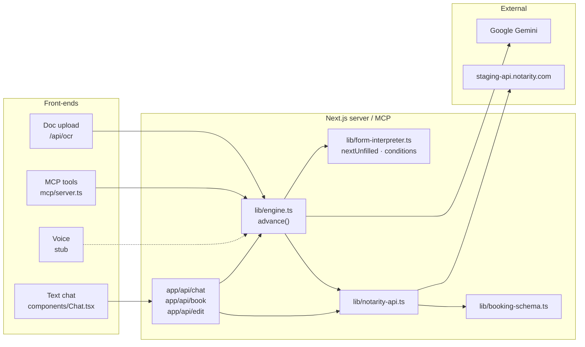

# Formless

AI booking assistant that turns a notarity appointment into a short conversation — built for the **START Hack Vienna '26** case from **Notarity**.

A client arrives with a document and no idea what they need. Through **text chat**, **document upload (OCR)**, or (planned) **voice**, Formless reads the **live** Notarity booking-form schema, asks only what that schema requires, assembles a zod-validated `AppointmentRequest`, prices it server-side, and submits — in under three minutes. The interpreter is **generic**: product ids, tags, timeslot labels, and question order all come from the API, not hardcoded lists.

---

## About

Notarity's booking flow is powerful but form-heavy: clients must pick products, upload documents per product, choose timeslots, and fill billing details against a conditional schema they often don't understand. **Formless** wraps that contract in a conversation.

We fetch `GET /booking-form/slug?slug=start-vienna-hackathon`, walk `pages[] → components[] → conditions`, and drive questions from whatever is **visible and unfilled**. Gemini (`@google/genai`) extracts natural-language answers into typed values; every merge passes through **zod** before it touches Notarity. Price is **never** computed in the browser — we always `POST /appointment-requests/price` and sum `net` (cents) ÷ 100.

**Verified reference flow:** Joshua / Spain NIE application → **€580** (`contract-check` + `engine-replay` + browser demo).

## The challenge

Notarity challenged us to **reimagine the booking form**. The raw material is a declarative, page-based schema (country pickers, product pickers, conditions, timeslots) and a strict multipart submit contract. Judges can swap the config; a hardcoded wizard breaks. Our goal is a **schema-driven interpreter** that still produces a valid payload every time.

## What we built

- **Form interpreter** (`lib/form-interpreter.ts`) — evaluates `ISDEFINED`, `INCLUDES`, `EQUAL`, `INTERSECTS`, `ISTRUE`, `AND`/`OR`/`NOT`; exposes `nextUnfilled`; honours auto-add rules (e.g. NIE application → NIE Personal Data); binds each uploaded PDF to **one** product (`sessionFileOwners`, no cross-product reuse)
- **Conversation engine** (`lib/engine.ts`) — shared brain for chat, OCR confirm, and MCP; Gemini structured extraction; `validateAnswer` at ask-time (email, phone); live `/price` on selection change; step types: `ask`, `fileUpload`, `form`, `complete`
- **Notarity client** (`lib/notarity-api.ts`, re-exported as `lib/notarity.ts` for Next.js routes) — full 5-call flow; scripts import `notarity-api` directly (`server-only` blocks Bun otherwise)
- **Text chat UI** (`components/Chat.tsx`) — quick-replies, inline party forms, Geoapify address autocomplete, live price sidebar, summary + submit
- **OCR upload** (`app/api/ocr/route.ts`, `lib/ocr-inference.ts`) — multimodal Gemini reads PDFs/images; maps hints to catalog products; optional `OCR_MOCK=1` + `.ocr-cache/` fixtures
- **MCP server** (`mcp/server.ts`) — stdio tools for external agents on the same engine
- **Contract proofs** (`scripts/contract-check.ts`, `scripts/engine-replay.ts`) — staging `/price` and full engine replay without UI

### Tech stack

| Layer | Choice | Why |
|-------|--------|-----|
| Runtime / package manager | **Bun** | Fast install, native TypeScript, runs scripts and MCP |
| Framework | **Next.js 15** App Router | Server routes for secrets; `app/api/*` proxies Notarity + Gemini |
| Language | **TypeScript** (strict) | Payload safety; mirrors Notarity field names verbatim |
| UI | **React 19**, **Tailwind 4**, **shadcn/ui** | Presentational chat + summary; `components/ui/*` |
| Validation | **zod** (`lib/booking-schema.ts`) | LLM output never trusted raw |
| LLM | **Google Gemini** (`@google/genai`) | Engine extraction (`gemini-3.5-flash`); multimodal OCR with model fallback chain |
| Address autocomplete | **Geoapify** (`app/api/address/route.ts`) | Billing/shipping typeahead when `GEOAPIFY_API_KEY` is set |
| Voice (planned) | **ElevenLabs** | `components/VoiceButton.tsx` is a stub; `ELEVENLABS_API_KEY` reserved in `.env.example` |
| Agents | **MCP SDK** (`@modelcontextprotocol/sdk`) | `start_booking` / `answer` / `get_price` / `submit_booking` |

## Demo

- **Local:** `bun dev` → http://localhost:3000
- **Reference payload:** Joshua / Spain NIE — **€580** (NIE application €550 + hard copy €30; NIE Personal Data €0)
- **Notarity staging UI (comparison):** https://staging.notarity.com/#/book/start-vienna-hackathon/
- **No Notarity API key required** — staging is open; only `GEMINI_API_KEY` is required for chat/OCR

---

## Getting started

### Prerequisites

- [Bun](https://bun.sh) v1.1+
- **`GEMINI_API_KEY`** — required for chat engine and live OCR
- Optional: **`GEOAPIFY_API_KEY`** — address autocomplete in party forms
- Optional: **`OCR_MOCK=1`** — serve OCR from `.ocr-cache/` (zero Gemini quota)
- **Notarity staging** — no API key; defaults to `https://staging-api.notarity.com`

### Setup

```bash
git clone https://github.com/paul-b-at/formless.git
cd formless
cp .env.example .env.local
bun install
```

Fill `.env.local` (never commit it):

```bash
# Required for chat + live OCR
GEMINI_API_KEY=your_key_here

# Optional — defaults shown
NOTARITY_API_BASE=https://staging-api.notarity.com
OCR_MODELS=gemini-3.5-flash,gemini-3.0-flash,gemini-2.5-flash,gemini-2.0-flash
OCR_MOCK=0
GEOAPIFY_API_KEY=
ELEVENLABS_API_KEY=
```

### Run

```bash
bun dev          # Next.js app → http://localhost:3000
bun test         # unit tests (form-interpreter, validation, OCR helpers, …)
bun run contract-check   # POST /price only → expect €580
bun run engine-replay    # full Joshua flow via engine → expect €580
bun run mcp/server.ts    # MCP stdio server (agents)
```

### Verify (no UI)

```bash
bun test
bun run scripts/contract-check.ts
bun run scripts/engine-replay.ts
```

Expected: contract-check prints line items and **`Euro total: €580`**; engine-replay ends with **`Engine replay passed.`** and **`Gemini API calls this run: 0`** (scripted answers resolve without LLM when options match).

### Joshua demo flow (browser)

Demo PDFs live in `notarity-reference/` (gitignored `*.pdf` — copy from Notarity or use your own matching filenames).

**Path A — OCR start**

1. At conversation start, drag **`nie-application-demo-joshua_timms.pdf`** into the **document upload zone** (not the chat attach button).
2. Confirm detected **Spain** + **Nie number application** when prompted.
3. When asked for **NIE Personal Data**, click **Attach** (paperclip next to chat input) → pick **`nie_personal_details.pdf`**.
4. Enter **`joshua.timms@notarity.com`** for participants.
5. Pick a **timeslot** quick-reply.
6. Fill **billing** and **shipping** in the inline forms (or use address autocomplete if Geoapify is configured).
7. Confirm **same as billing** for contact; **yes** for hard copy; separate **shipping address** (Barcelona fixture in `scripts/engine-replay.ts`).
8. Review **€580** in Summary → **Book it** (`mode: "debug"` + draft id).

**Path B — manual (no OCR)**

1. Choose **Spain (ES)** → **Nie number application**.
2. **Attach** → `nie-application-demo-joshua_timms.pdf`.
3. **Attach** again → `nie_personal_details.pdf` (re-attaching the application PDF on the Personal Data step should error).
4. Continue as in steps 4–8 above.

**Expected product files in payload**

| Product | `products[].files` |
|---------|-------------------|
| Nie number application | `nie-application-demo-joshua_timms.pdf` |
| NIE Personal Data | `nie_personal_details.pdf` |

### MCP server (agents)

Exposes the same engine over stdio. See `mcp/README.md` and `skills/notarity-booking/SKILL.md`.

| Tool | Purpose |
|------|---------|
| `start_booking({ slug? })` | Bootstrap session; default slug `start-vienna-hackathon` |
| `answer({ sessionId, userMessage })` | Advance conversation (filenames as text for product uploads) |
| `get_price({ sessionId })` | `POST /price` via `priceRequest` |
| `submit_booking({ sessionId, confirm })` | Submit only if `confirm === true`; forces `mode: "debug"`; reads PDFs from `notarity-reference/` |

```bash
# Claude Code
claude mcp add formless-notarity -- bun run mcp/server.ts

# Cursor — set cwd to your clone path
# { "mcpServers": { "formless-notarity": { "command": "bun", "args": ["run", "mcp/server.ts"], "cwd": "/path/to/formless" } } }
```

**Agent tip:** prefer `structuredContent.step` from tool responses over human `content` text — `fileUpload` / `form` steps are not fully formatted in the text layer yet.

---

## Project structure

```
app/
  page.tsx                 # Chat + Summary layout
  api/
    chat/route.ts          # POST — engine turn (advance); uploadKind + uploadProductId for per-product files
    book/route.ts          # POST multipart — zod validate, price, submit to Notarity
    ocr/route.ts           # POST multipart — inferFromDocument (Gemini multimodal or OCR_MOCK cache)
    address/route.ts       # GET — Geoapify autocomplete proxy
    edit/route.ts          # POST — applySurgicalEdit (summary field corrections)
components/
  Chat.tsx                 # Messages, quick-replies, OCR zone, attach button, party forms
  Summary.tsx              # Price breakdown, payload review, Book it
  VoiceButton.tsx          # Stub — not wired into UI
  ui/                      # shadcn primitives
lib/
  booking-schema.ts        # zod AppointmentRequest + Party + ProductSelection
  notarity-api.ts          # Staging client: getBookingForm, getProductsByTags, getTimeslots, priceRequest, submitRequest
  notarity.ts              # server-only re-export for app routes
  form-interpreter.ts      # Schema parse, evaluateCondition, nextUnfilled, applyAnswer, file→product binding
  engine.ts                # Gemini brain, EngineState/EngineStep, advance(), applySurgicalEdit()
  field-validation.ts      # Email/phone ask-time validation; rejects filenames as emails
  party-sanitize.ts        # Empty-string → omitted optional fields before zod
  ocr-inference.ts         # Document → country/product hints + party extraction
  ocr-cache.ts             # OCR_MOCK + .ocr-cache/<basename>.json
  gemini-ocr.ts            # OCR model fallback chain (OCR_MODELS env)
  gemini-model.ts          # Engine model constant (gemini-3.5-flash)
  …                        # answer-resolution, collected-edit, timeslot-format, price-display, ocr-product-map, …
mcp/
  server.ts                # MCP stdio server (in-memory sessions)
  README.md                # Tool docs + registration
skills/
  notarity-booking/SKILL.md  # Agent workflow rules
scripts/
  contract-check.ts        # Known-good Joshua payload → POST /price
  engine-replay.ts         # Scripted conversation → complete payload → €580
.ocr-cache/                # OCR mock fixtures (e.g. nie-application-demo-joshua_timms.json)
notarity-reference/        # Notarity's reference JS + demo PDFs (read-only contract docs)
```

---

## Configuration

| Variable | Required | Description |
|----------|----------|-------------|
| `GEMINI_API_KEY` | Yes (chat/OCR) | Google Gemini for engine extraction and live OCR |
| `NOTARITY_API_BASE` | No | Default `https://staging-api.notarity.com` — **no API key needed** |
| `OCR_MODELS` | No | Comma-separated fallback chain for OCR (see `.env.example`) |
| `OCR_MOCK` | No | `1` / `true` / `yes` → read `.ocr-cache/<basename>.json` only; zero Gemini calls |
| `GEOAPIFY_API_KEY` | No | Enables `GET /api/address?text=…` autocomplete in party forms |
| `ELEVENLABS_API_KEY` | No | Reserved; voice not implemented |

**Secrets:** only in `.env.local` (gitignored). Never use `NEXT_PUBLIC_*` for API keys. See `.env.example`.

### Safety & testing

- **`mode: "debug"`** — engine `applyDefaults()` sets this; MCP `submit_booking` also forces it
- **Test draft id** — `_appointmentRequestDraft: vfniS9nfoq8nMpRqQj7Z` (applied by engine; reduces email side effects)
- **Submit sends real emails** — keep debug + draft while testing; `contract-check` only calls `/price` (side-effect free)
- **OCR iteration** — set `OCR_MOCK=1` and add `.ocr-cache/<filename-without-ext>.json` to develop without Gemini quota
- **MCP sessions** — ephemeral `Map<sessionId, EngineState>`; restart loses state; submit reads PDFs from `notarity-reference/` on disk

## Architecture & assumptions

The **live booking-form schema** is the source of truth — not a hardcoded question list. All Notarity and Gemini calls run **server-side** in `app/api/*` (and `mcp/server.ts`). The client never holds staging credentials.

### Five-call Notarity flow

```
1. GET  /booking-form/slug?slug=start-vienna-hackathon     → form schema
2. GET  /products/tags?_tags=<tagId>                       → product defs for pickers
3. GET  /appointment-requests/timeslots?...                → slot ids (max 8-day window)
4. POST /appointment-requests/price                        → authoritative line items (cents)
5. POST /appointment-requests                              → multipart: payload JSON + files
```

**Price rule:** `confirmedPrice` (euros) = sum of `/price` line-item `net` (cents) ÷ 100. Never computed client-side.

### System diagram



### Three front-ends, one engine

| Front-end | Status | Entry |
|-----------|--------|-------|
| Text chat | **Shipped** | `POST /api/chat` → `advance()` |
| OCR upload | **Shipped** | Start-of-flow `DocumentUploadZone` → `POST /api/ocr` → confirm → engine; per-product files via attach button + `uploadKind: "file"` |
| Voice | **Stub** | `VoiceButton.tsx` — not integrated |
| MCP agents | **Shipped** | `start_booking` / `answer` / … on same `advance()` |

### Data contract

Full schema: [`lib/booking-schema.ts`](lib/booking-schema.ts). Field names are **Notarity's** — do not rename.

**Top-level `AppointmentRequest` (selected fields)**

| Field | Notes |
|-------|--------|
| `_bookingForm` | Id from live form schema |
| `_appointmentRequestDraft` | Optional; engine sets test draft in debug |
| `mode` | `"debug"` \| `"live"` — stay on debug for hackathon |
| `destinationCountry` | ISO-3166 alpha-2 |
| `products[]` | `ProductSelection`: `id`, `apostille`, `files[]`, … |
| `participants[]` | `{ email, client, supervisor }` |
| `timeslots[]` | Real slot **ids** from call #3 |
| `billingDetails` / `contactDetails` / `shippingDetails` | `Party` shape |
| `hardCopy` | `{ hardCopy, expressShipping }` |
| `confirmedPrice` | Euros; must match `/price` sum |

**`Party` gotchas**

- `email` — validated at ask-time (`lib/field-validation.ts`); filenames like `foo.pdf` are rejected
- `phoneNumber` — **required** non-empty string in zod
- `countryCode` — optional ISO-2; **empty string fails** zod — `lib/party-sanitize.ts` strips blanks to omitted before parse
- Optional address fields — omit when blank, don't send `""`

**`products[].files`**

- Each string must **exactly match** a multipart filename at submit
- One file per product step — `sessionFileOwners` prevents cross-product reuse
- UI: OCR seeds only the product it matched; each other file-upload product needs its own attach

### Known limitations & next steps

| Area | Reality |
|------|---------|
| Voice | `VoiceButton.tsx` stub; no ElevenLabs integration |
| MCP `answer` | Text only — no `uploadKind` / `structuredAnswer`; filenames like engine-replay |
| MCP responses | `fileUpload` / `form` steps: read `structuredContent.step`, not summary text |
| MCP files | Submit loads PDFs from `notarity-reference/` — not browser uploads |
| Personas | Joshua/Spain path is verified; Robert (PoA) / Elizabeth (AT FlexCo) not fully demo'd |
| Sessions | MCP in-memory only |
| Admin | No config editor — interpreter must stay generic |

**Possible next steps:** wire ElevenLabs to `advance()`; MCP file upload bytes; harden MCP step text formatting; Robert/Elizabeth replay scripts; root `bun run mcp` script.

## Troubleshooting

- **Chat returns 500** → check `GEMINI_API_KEY` in `.env.local`
- **€580 mismatch** → `bun run scripts/contract-check.ts` isolates the Notarity client
- **Book it fails on files** → `products[].files` names must match uploaded PDF filenames byte-for-byte
- **No timeslots** → staging window is max 8 days; pick a slot from quick-replies
- **OCR always falls back to chat** → set `OCR_MOCK=1` and add `.ocr-cache/<basename>.json`, or check `OCR_MODELS` / quota
- **Address autocomplete empty** → set `GEOAPIFY_API_KEY`; without it, forms still work (manual entry)
- **Wrong file on wrong product** → use Attach on file-upload steps; don't type filenames into email fields

---

## Team

**Formless** — START Hack Vienna '26

## Submission

- Track: **START Hack Vienna '26** · Case partner: **Notarity**
- Repository: https://github.com/paul-b-at/formless

## License

Released under the MIT License — see [`LICENSE`](LICENSE).
